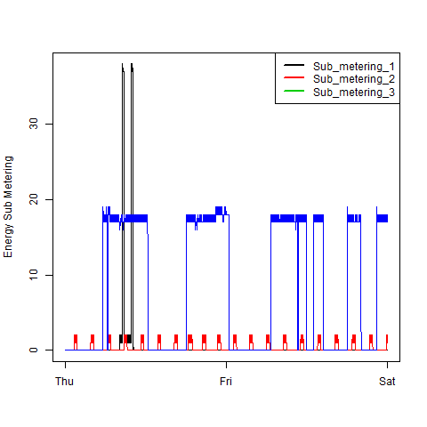
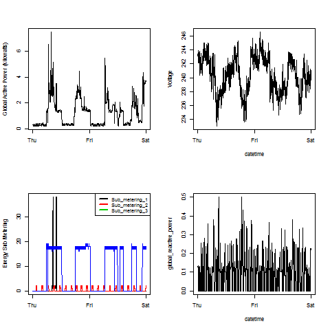

## Introduction
Our overall goal here is to create several plots to help us examine how household energy usage varies over a 2-day period in February, 2007.  Data comes from the <a href="http://archive.ics.uci.edu/ml/">UC Irvine Machine Learning Repository</a>,  a popular repository for machine learning datasets.

## Data
This assignment uses data from the <a href="http://archive.ics.uci.edu/ml/">UC Irvine Machine
Learning Repository</a>. In particular, the "Individual household
electric power consumption Data Set" which has been made available on
the course web site:

* <b>Dataset</b>: <a href="https://d396qusza40orc.cloudfront.net/exdata%2Fdata%2Fhousehold_power_consumption.zip">Electric power consumption</a> [20Mb]

* <b>Description</b>: Measurements of electric power consumption in
one household with a one-minute sampling rate over a period of almost
4 years. Different electrical quantities and some sub-metering values
are available.

The following descriptions of the 9 variables in the dataset are taken
from the <a href="https://archive.ics.uci.edu/ml/datasets/Individual+household+electric+power+consumption">UCI
web site</a>:

<ol>
<li><b>Date</b>: Date in format dd/mm/yyyy </li>
<li><b>Time</b>: time in format hh:mm:ss </li>
<li><b>Global_active_power</b>: household global minute-averaged active power (in kilowatt) </li>
<li><b>Global_reactive_power</b>: household global minute-averaged reactive power (in kilowatt) </li>
<li><b>Voltage</b>: minute-averaged voltage (in volt) </li>
<li><b>Global_intensity</b>: household global minute-averaged current intensity (in ampere) </li>
<li><b>Sub_metering_1</b>: energy sub-metering No. 1 (in watt-hour of active energy). It corresponds to the kitchen, containing mainly a dishwasher, an oven and a microwave (hot plates are not electric but gas powered). </li>
<li><b>Sub_metering_2</b>: energy sub-metering No. 2 (in watt-hour of active energy). It corresponds to the laundry room, containing a washing-machine, a tumble-drier, a refrigerator and a light. </li>
<li><b>Sub_metering_3</b>: energy sub-metering No. 3 (in watt-hour of active energy). It corresponds to an electric water-heater and an air-conditioner.</li>
</ol>

## Loading the data

* The dataset was loaded using fread()
* The dataset has 2,075,259 rows and 9 columns. 
* The dataset has many values that should be treated as NA/missing ('?','NA','N/A','')
* Subset the data by date during fread to reduce load time.  We will only be using data from the dates 2007-02-01 and 2007-02-02. 
* Converted the Date and Time variables to Date/Time classes in R using the `strptime()` and `as.Date()`
functions.

## Making Plots
The following plots were created from individual .R files using the base plotting system.  They were saved as .PNG files to include in this README report.

### Histogram of Global Active Power (GAP)

 

### Global Active Power Over Time

 

### Energy Sub Metering Over Time

 

### Four Plots Together

 

