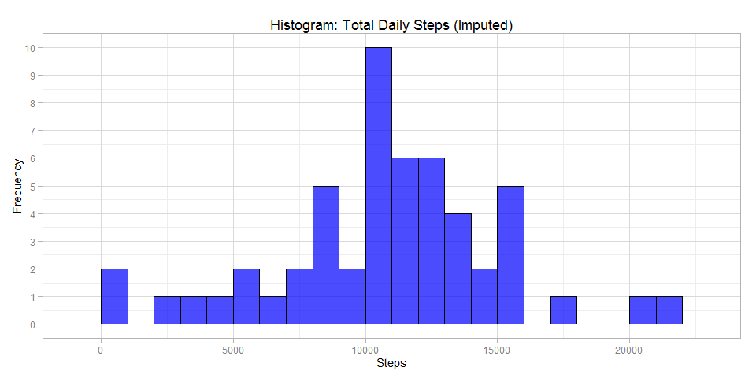
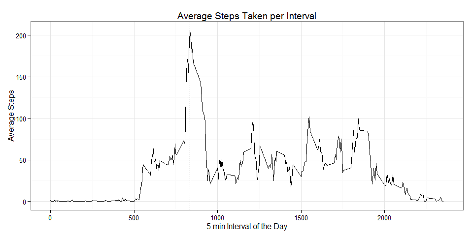
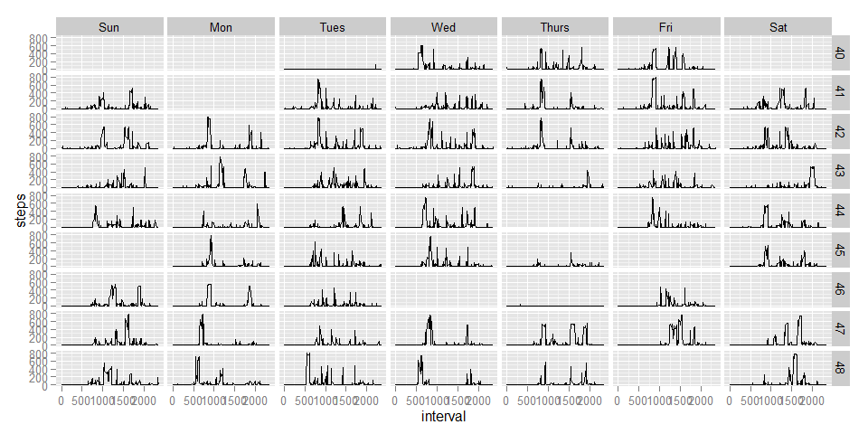
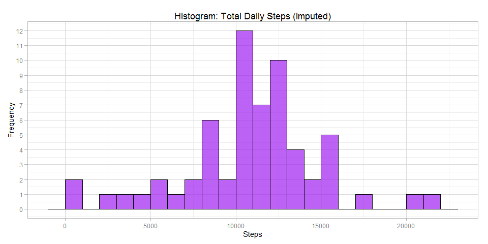
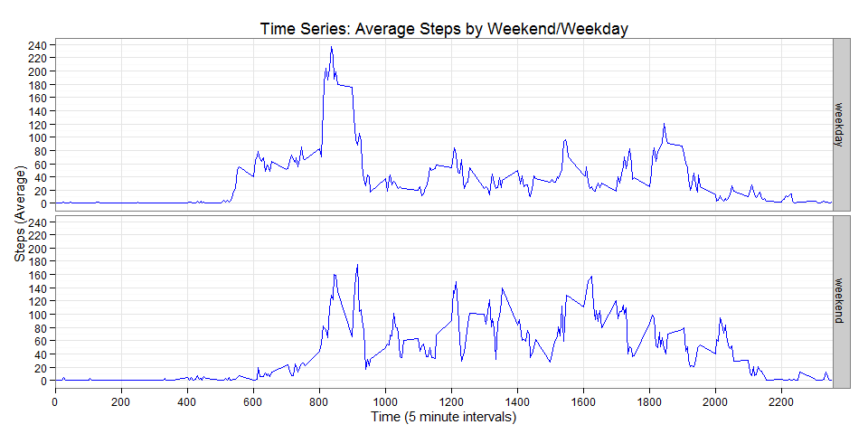

# Analysis of Personal Activity Monitoring

# Introduction 

It is now possible to collect a large amount of data about personal
movement using activity monitoring devices such as a
[Fitbit](http://www.fitbit.com), [Nike Fuelband](http://www.nike.com/us/en_us/c/nikeplus-fuelband), or
[Jawbone Up](https://jawbone.com/up). These type of devices are part of
the "quantified self" movement -- a group of enthusiasts who take
measurements about themselves regularly to improve their health, to
find patterns in their behavior, or because they are tech geeks. But
these data remain under-utilized both because the raw data are hard to
obtain and there is a lack of statistical methods and software for
processing and interpreting the data.

This analysis makes use of data from a personal activity monitoring
device. This device collects data at 5 minute intervals through out the
day. The data consists of two months of data from an anonymous
individual collected during the months of October and November, 2012
and include the number of steps taken in 5 minute intervals each day.

# Data  - *([toc](#TOC))*

The data for this analysis was downloaded from here: [Activity monitoring data](https://d396qusza40orc.cloudfront.net/repdata%2Fdata%2Factivity.zip) [52K]

The variables included in this dataset are:

1. **steps**: Number of steps taking in a 5-minute interval 
    1. missing values are coded as `NA` where device may be off.
    1. there are many entries with '0' value where subject could be resting or sleeping
1. **date**: The date on which the measurement was taken in YYYY-MM-DD format
1. **interval**: Identifier for the 5-minute interval in which measurement was taken. (it's the hours and minutes 'hhmm' in military time)

The dataset is stored in a comma-separated-value (CSV) file and there are a total of 17,568 observations in this dataset.


# Analysis

## Loading and preprocessing the data  - *([toc](#TOC))*

```r
# set global option to echo everything so that code is visible.
library(knitr)
## Warning: package 'knitr' was built under R version 3.2.1
library(data.table)
## Warning: package 'data.table' was built under R version 3.2.1
library(lubridate)
library(dplyr)
## Warning: package 'dplyr' was built under R version 3.2.1
library(ggplot2)
library(utils)
library(scales)
## Warning: package 'scales' was built under R version 3.2.1
knitr::opts_chunk$set(echo = TRUE, cache=TRUE, cache.path="cache/", fig.width=10, fig.path="figure/")
```

This analysis assumes that the zip file has already been downloaded and placed in the same directory as this .Rmd file.  

First we unzip the data, load it into a dataframe, and take a look at it.


```r
unzip(zipfile="activity.zip")

#using data.table, load data
DT <- fread("activity.csv")

#using lubridate, covert date field to date type
DT$date <- ymd(DT$date) 

#create a timestamp from the date and interval fields (interval is 24hour time without 0's)
cTS <- paste0(DT$date, '_', formatC(DT$interval,width=4,format='d',flag='0'), '00')
DT$timestamp <- ymd_hms(cTS)
#strptime(cTS, format = '%Y-%m-%d_%H%M%S', tz = 'GMT')
#as.POSIXlt(cTS, format='%Y-%m-%d_%H%M%S', origin='1970-01-01',tz='GMT')

#Create days of week
DT$dayOfWeek <- wday(DT$date, label=TRUE)

#Create Week of Year
DT$weekOfYear <- week(DT$date)

#check data types
str(DT)
## Classes 'data.table' and 'data.frame':	17568 obs. of  6 variables:
##  $ steps     : int  NA NA NA NA NA NA NA NA NA NA ...
##  $ date      : POSIXct, format: "2012-10-01" "2012-10-01" ...
##  $ interval  : int  0 5 10 15 20 25 30 35 40 45 ...
##  $ timestamp : POSIXct, format: "2012-10-01 00:00:00" "2012-10-01 00:05:00" ...
##  $ dayOfWeek : Ord.factor w/ 7 levels "Sun"<"Mon"<"Tues"<..: 2 2 2 2 2 2 2 2 2 2 ...
##  $ weekOfYear: num  40 40 40 40 40 40 40 40 40 40 ...
##  - attr(*, ".internal.selfref")=<externalptr>

#get data summaries
summary(DT)
##      steps             date               interval     
##  Min.   :  0.00   Min.   :2012-10-01   Min.   :   0.0  
##  1st Qu.:  0.00   1st Qu.:2012-10-16   1st Qu.: 588.8  
##  Median :  0.00   Median :2012-10-31   Median :1177.5  
##  Mean   : 37.38   Mean   :2012-10-31   Mean   :1177.5  
##  3rd Qu.: 12.00   3rd Qu.:2012-11-15   3rd Qu.:1766.2  
##  Max.   :806.00   Max.   :2012-11-30   Max.   :2355.0  
##  NA's   :2304                                          
##    timestamp                   dayOfWeek      weekOfYear   
##  Min.   :2012-10-01 00:00:00   Sun  :2304   Min.   :40.00  
##  1st Qu.:2012-10-16 05:58:45   Mon  :2592   1st Qu.:42.00  
##  Median :2012-10-31 11:57:30   Tues :2592   Median :44.00  
##  Mean   :2012-10-31 11:57:30   Wed  :2592   Mean   :44.13  
##  3rd Qu.:2012-11-15 17:56:15   Thurs:2592   3rd Qu.:46.00  
##  Max.   :2012-11-30 23:55:00   Fri  :2592   Max.   :48.00  
##                                Sat  :2304
```


## What is mean total number of steps taken per day?  - *([toc](#TOC))*

Excluding any missing values, we group the number of steps by day, summarize the data, and create a histogram of the daily steps.

```r
#using dplyr
DFT <- tbl_df(DT)

#drop rows that have NA for steps
DFT_notnull <- DFT[complete.cases(DFT),]

#calculate daily total count
dailyTotals <- aggregate(steps ~ date, DFT, FUN = sum)

#Create a histogram of the total number of steps taken each day.
ggplot(data=dailyTotals, aes(steps)) +
    geom_histogram( binwidth = 1000, fill = "blue", colour = "black", alpha = 0.7 ) +
    scale_y_continuous(breaks = pretty_breaks(10)) +
    theme_light(base_family = "sans", base_size = 11) +
    labs(x = "Steps", y = "Frequency") +
    ggtitle("Histogram: Total Daily Steps (Imputed)")
```

 


```r
# calculate mean and median from daily imputed totals
stepsMean <- prettyNum(mean(dailyTotals$steps), big.mark=",")
stepsMedian <- prettyNum(median(dailyTotals$steps), big.mark=",")
```
The **mean** of total number of steps taken per day is 10,766.19.  
The **median** of total number of steps taken per day is 10,765.  

## What is the average daily activity pattern?  - *([toc](#TOC))*

Below is a time series plot of the 5-minute interval (x-axis) and the average number of steps taken, averaged across all days (y-axis)

```r
ggplot(data = DFT_notnull, aes(x = interval, y = steps)) + 
    stat_summary(fun.y="mean", geom="line") +
    geom_vline( xintercept=835, linetype="dotted") +
    theme_bw() +
    labs(x = "5 min Interval of the Day", y = "Average Steps") +
    ggtitle("Average Steps Taken per Interval")
```

 

The 5-minute interval, 835 (or 08:35) contains the maximum number of steps on average (~206), across all the days in the dataset.

```r
avg_steps_by_interval <- DFT_notnull %>%
    group_by(interval) %>%
    summarize(interval_avg_steps = mean(steps)) %>%
    arrange(desc(interval_avg_steps))
```

**Just for Fun** I wanted to see a facet grid of the days in the study to get an idea of any patterns based on day of the week.  


```r
#Create a facet grid for each days activity
ggplot(data = DFT, aes(x = interval, y = steps)) + 
    geom_line() +
    facet_grid(weekOfYear ~ dayOfWeek)
```

 


## Imputing missing values  - *([toc](#TOC))*

There are a number of days/intervals where there are missing values (coded as NA).  The presence of missing days may introduce bias into some calculations or summaries of the data.


```r

missing <- sum(is.na(DFT$steps))
total <- length(DFT$steps)
missingSteps <- prettyNum(missing, big.mark = ",")
totalSteps <- prettyNum(total, big.mark = ",")
percentSteps <- percent(missing/total)

#check if each date is missing all intervals. there are 60 days in the study and 288 intervals in one day....confirmed
days_with_na <- distinct(DFT[is.na(DFT$steps),2])
for (d in days_with_na) {
    cnt<-count(DFT[DFT$date==ymd(d),])
    print(paste0(d,":", cnt))
}
## [1] "2012-10-01:288" "2012-10-08:288" "2012-11-01:288" "2012-11-04:288"
## [5] "2012-11-09:288" "2012-11-10:288" "2012-11-14:288" "2012-11-30:288"
```

Looking at the missing values we find that there are 2,304 of 17,568 rows without step values, which is around 13.1%. Also, all missing values occur on 8 days during the 61 day study and across all intervals.  

The strategy to impute the missing steps will be to use the mean/average for that weekdays 5-minute interval. In other words, we are modelling against similar activity for that time interval for that day of week. We are making the assumption that activity for a day is much the same: one Monday looks like any other Monday.    

First, calculate the mean/average by dayOfWeek and 5-minute time interval and store it in a lookup table:


```r
# create mapping table with dayOfWeek, interval, and the average value
avgIntervalsByDayOfWeek <- DFT %>%
    group_by(dayOfWeek,interval) %>%
    summarize(avgIntervalByDay = ceiling(mean(steps, na.rm = TRUE)) ) 
```

Next, we merge/join that lookup table into the full data and store the result in a new imputed data set:

```r
# use dplyr to left join Avg Intervals Per dayOfWeek to the imputed data set DFTI
# where steps is missing (NA) use the median of the dayOfWeek interval to replace the NA value
# select only required columns
DFTI <- DFT %>%
    left_join(y = avgIntervalsByDayOfWeek, by = c("dayOfWeek","interval")) %>%
    mutate(steps = ifelse(is.na(steps), avgIntervalByDay, steps)) %>%
    select(date, interval, steps, weekOfYear, dayOfWeek )

#Verify that there are no more missing values.  
table(complete.cases(DFTI))
## 
##  TRUE 
## 17568
```


The following steps in our analysis will use these imputed results.  Let's create a histogram of the total number of steps taken each day using the imputed data:

```r
dailyImputedTotals <- aggregate(steps ~ date, DFTI, FUN = sum)

ggplot(data=dailyImputedTotals, aes(steps)) +
    geom_histogram( binwidth = 1000, fill = "purple", colour = "black", alpha = 0.7 ) +
    scale_y_continuous(breaks = pretty_breaks(10)) +
    theme_light(base_family = "sans", base_size = 11) +
    labs(x = "Steps", y = "Frequency") +
    ggtitle("Histogram: Total Daily Steps (Imputed)")
```

 


Earlier we calculated the mean and median steps with missing values.  We'll compare them with the imputed data set:


```r
# calculate mean and median from daily imputed totals
stepsMeanImputed <- prettyNum(mean(dailyImputedTotals$steps), big.mark=",")
stepsMedianImputed <- prettyNum(median(dailyImputedTotals$steps), big.mark=",")
```
The **original mean** of total number of steps taken per day is 10,766.19.  
The **original median** of total number of steps taken per day is 10,765.  
The **imputed mean** of total number of steps taken per day is 10,832.66.  
The **imputed median** of total number of steps taken per day is 11,015.  


Imputing the data seems to have increased the steps in the middle of the range.  The mean and median are both slightly increased but not significantly.


## Are there differences in activity patterns between weekdays and weekends?  - *([toc](#TOC))*

Aggregate the imputed data (DFTI) and compare weekday and weekend activity.


```r
#Create 'weekend' factor variable on the imputed data
DFTI$weekend <- as.factor(ifelse(DFTI$dayOfWeek %in% c("Sat","Sun"),"weekend","weekday"))

avgWeekEndSteps <- DFTI %>%
    group_by(weekend,interval) %>%
    summarize(avgSteps = mean(steps)) 

avgWeekEndSteps %>%
    ggplot(aes(x=interval, y=avgSteps))+
    geom_line(colour = "blue") +
    facet_grid(weekend ~ .) +
    theme_bw(base_family = "sans", base_size = 11) +
    scale_x_discrete(breaks = pretty_breaks(15)) +
    scale_y_continuous(breaks = pretty_breaks(10)) +
    labs(x = "Time (5 minute intervals)", y = "Steps (Average)") +
    ggtitle("Time Series: Average Steps by Weekend/Weekday")
```

 

It appears that in the mornings the individual took more steps in the morning on weekdays and that they took more steps during the day and evenings on the weekend.  Some possible factors that might be at play could include exercise, work schedule, and prefered weekend activities.  But there is no data currently available to investigate these possibilities.
