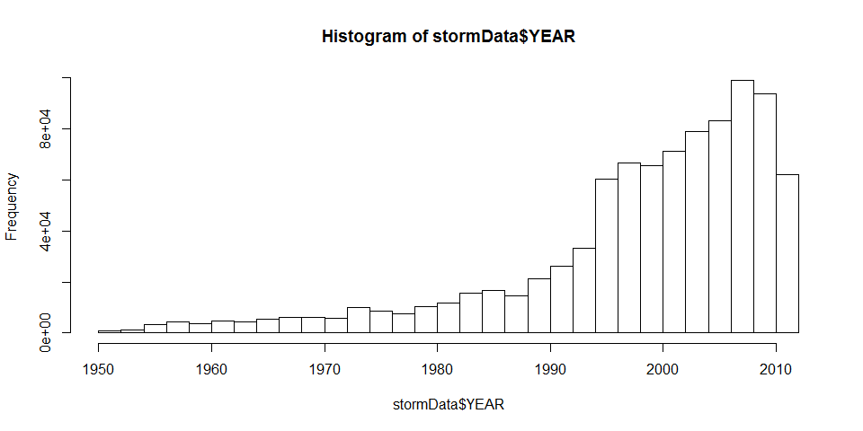
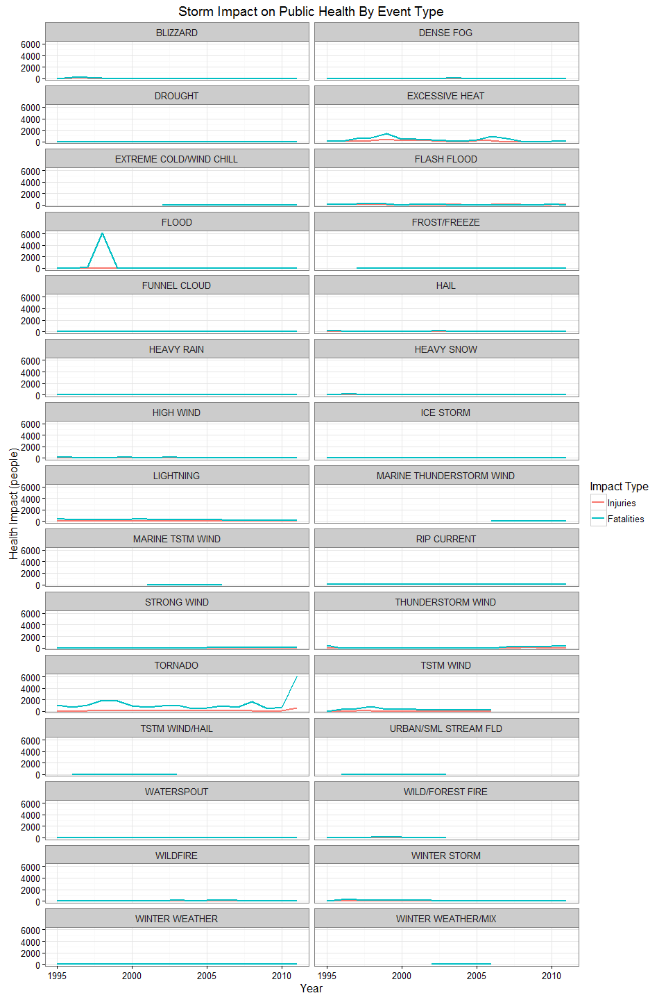
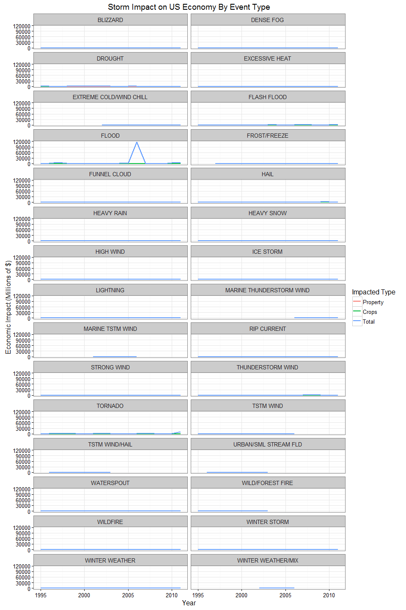

# Impact of Severe Weather Events on Public Health and Economy in the United States

# Synopsis

Storms and other severe weather events can cause both public health and economic problems for communities and municipalities. Many severe events can result in fatalities, injuries, and property damage, and preventing such outcomes to the extent possible is a key concern.  This report is meant to provide guidance on where to prioritize resources to prepare for and deal with different types of severe weather events.

Data comes from the U.S. National Oceanic and Atmospheric Administration's (NOAA) storm database. This database tracks characteristics of major storms and weather events in the United States, including when and where they occur, as well as estimates of any fatalities, injuries, and property damage.

During this analysis we looked at differnt types of storm events (as indicated in the `EVTYPE` variable) and found that: 

1. Across the United States, the types of events most harmful with respect to **population health** are TORNADO, EXCESSIVE HEAT, FLOOD, FLASH FLOOD, and LIGHTNING.
1. Across the United States, the types of events which have the greatest **economic consequences** are FLOOD, TORNADO, HAIL, FLASH FLOOD, and DROUGHT.


# Data

## Data Overview

The data for this analysis was downloaded from this [Storm Data Link](https://d396qusza40orc.cloudfront.net/repdata%2Fdata%2FStormData.csv.bz2) [47Mb]. The format is a comma-separated-value file compressed via the bzip2 algorithm to reduce its size.  Below are some links to the available documentation on how some of the variables are constructed/defined:

* National Weather Service [Storm Data Documentation](https://d396qusza40orc.cloudfront.net/repdata%2Fpeer2_doc%2Fpd01016005curr.pdf)
* National Climatic Data Center Storm Events [FAQ](https://d396qusza40orc.cloudfront.net/repdata%2Fpeer2_doc%2FNCDC%20Storm%20Events-FAQ%20Page.pdf)
* [Storm Events NICAR Website](http://ire.org/nicar/database-library/databases/storm-events/)
* [Storm Events Data Layout Document](http://ire.org/media/uploads/files/datalibrary/samplefiles/Storm%20Events/layout08.doc)

## Data Processing
Following are the steps taken to get the data in a usable format to try to answer the desired questions.  

Load needed libraries.

```r
# set global option to echo everything so that code is visible.
library(knitr)
knitr::opts_chunk$set(echo = TRUE, collapse = TRUE, cache=TRUE, cache.path="cache/", fig.width=10, fig.path="figure/")
library(R.utils)
library(data.table)
library(lubridate)
library(dplyr)
library(ggplot2)
library(reshape2)
#library(utils)
library(scales)
sessionInfo()
## R version 3.2.5 (2016-04-14)
## Platform: x86_64-w64-mingw32/x64 (64-bit)
## Running under: Windows 10 x64 (build 10586)
## 
## locale:
## [1] LC_COLLATE=English_United States.1252 
## [2] LC_CTYPE=English_United States.1252   
## [3] LC_MONETARY=English_United States.1252
## [4] LC_NUMERIC=C                          
## [5] LC_TIME=English_United States.1252    
## 
## attached base packages:
## [1] stats     graphics  grDevices utils     datasets  methods   base     
## 
## other attached packages:
##  [1] scales_0.4.0      reshape2_1.4.1    ggplot2_2.1.0    
##  [4] dplyr_0.4.3       lubridate_1.3.3   data.table_1.9.6 
##  [7] R.utils_2.1.0     R.oo_1.19.0       R.methodsS3_1.7.0
## [10] knitr_1.10.5     
## 
## loaded via a namespace (and not attached):
##  [1] Rcpp_0.11.6      magrittr_1.5     munsell_0.4.2    colorspace_1.2-6
##  [5] R6_2.0.1         stringr_1.0.0    plyr_1.8.3       tools_3.2.5     
##  [9] parallel_3.2.5   grid_3.2.5       gtable_0.1.2     DBI_0.3.1       
## [13] htmltools_0.3.5  yaml_2.1.13      digest_0.6.8     assertthat_0.1  
## [17] formatR_1.2      memoise_0.2.1    evaluate_0.7     rmarkdown_0.7   
## [21] stringi_0.4-1    chron_2.3-47
```

Download and Unzip the Storm Data.

```r
zipFileName <- "data/redata-pa2-StormData.csv.bz2"
unzFileName <- "data/redata-pa2-StormData.csv"
print("downloading  File  ...")
## [1] "downloading  File  ..."
download.file("http://d396qusza40orc.cloudfront.net/repdata%2Fdata%2FStormData.csv.bz2", destfile = zipFileName)
#print("unzipping  File  ...")
#bunzip2(filename = zipFileName, destname = unzFileName, overwrite=TRUE, remove=FALSE)
```


```r
unzFileName <- "data/redata-pa2-StormData.csv"
tstFileName <-"data/newlineIssueTest.csv"
stormData <- fread(input = tstFileName,  sep = ",", header=TRUE,
                   na.strings = c("?","NA","N/A","<NA>",""),
                   nrows = -1 )
## Warning in fread(input = tstFileName, sep = ",", header = TRUE, na.strings
## = c("?", : Bumped column 31 to type character on data row 17, field
## contains '"HARDEMAN - HARDEMAN - KNOX"'. Coercing previously read values
## in this column from logical, integer or numeric back to character which
## may not be lossless; e.g., if '00' and '000' occurred before they will
## now be just '0', and there may be inconsistencies with treatment of ',,'
## and ',NA,' too (if they occurred in this column before the bump). If this
## matters please rerun and set 'colClasses' to 'character' for this column.
## Please note that column type detection uses the first 5 rows, the middle
## 5 rows and the last 5 rows, so hopefully this message should be very rare.
## If reporting to datatable-help, please rerun and include the output from
## verbose=TRUE.
tail(stormData,3)
##    STATE__         BGN_DATE    BGN_TIME TIME_ZONE COUNTY   COUNTYNAME
## 1:      48 8/4/1996 0:00:00 06:20:00 PM       CST    233   HUTCHINSON
## 2:      48 8/4/1996 0:00:00 06:33:00 PM       CST    233   HUTCHINSON
## 3:      48 8/4/1996 0:00:00 09:55:00 PM       CST     83 TXZ083 - 087
##    STATE           EVTYPE BGN_RANGE BGN_AZI BGN_LOCATI         END_DATE
## 1:    TX        TSTM WIND         5       N     BORGER 8/4/1996 0:00:00
## 2:    TX             HAIL         5       N     BORGER 8/4/1996 0:00:00
## 3:    TX Summary August 4         0      NA         NA 8/4/1996 0:00:00
##       END_TIME COUNTY_END COUNTYENDN END_RANGE END_AZI END_LOCATI LENGTH
## 1: 06:20:00 PM          0         NA         5       N     BORGER      0
## 2: 06:33:00 PM          0         NA         5       N     BORGER      0
## 3: 10:15:00 PM          0         NA         0      NA         NA      0
##    WIDTH  F MAG FATALITIES INJURIES PROPDMG PROPDMGEXP CROPDMG CROPDMGEXP
## 1:     0 NA  52          0        0       0         NA       0         NA
## 2:     0 NA  88          0        0       0         NA       0         NA
## 3:     0 NA   0          0        0       0         NA       0         NA
##    WFO             STATEOFFIC                  ZONENAMES LATITUDE
## 1: AMA TEXAS, North Panhandle                         NA     3544
## 2: AMA TEXAS, North Panhandle                         NA     3544
## 3: OUN   TEXAS, Western North HARDEMAN - HARDEMAN - KNOX        0
##    LONGITUDE LATITUDE_E LONGITUDE_
## 1:     10123       3544      10123
## 2:     10123       3544      10123
## 3:         0          0          0
##                                                                                                                                                                                                                     REMARKS
## 1:                                                                                                                                                                                                                       NA
## 2:                                                                                 Thunderstorms over the central Texas panhandle produced high winds \r\nand hail as reported by storm spotters and emergency coordinator.
## 3: Severe thunderstorms moving into north Texas resulted in major wind damage north of Knox City in Knox County and in Quanah in Hardeman County.  See following individual Storm Data entries for details on these events.
##    REFNUM
## 1: 277033
## 2: 277034
## 3: 277035
sessionInfo()
## R version 3.2.5 (2016-04-14)
## Platform: x86_64-w64-mingw32/x64 (64-bit)
## Running under: Windows 10 x64 (build 10586)
## 
## locale:
## [1] LC_COLLATE=English_United States.1252 
## [2] LC_CTYPE=English_United States.1252   
## [3] LC_MONETARY=English_United States.1252
## [4] LC_NUMERIC=C                          
## [5] LC_TIME=English_United States.1252    
## 
## attached base packages:
## [1] stats     graphics  grDevices utils     datasets  methods   base     
## 
## other attached packages:
##  [1] scales_0.4.0      reshape2_1.4.1    ggplot2_2.1.0    
##  [4] dplyr_0.4.3       lubridate_1.3.3   data.table_1.9.6 
##  [7] R.utils_2.1.0     R.oo_1.19.0       R.methodsS3_1.7.0
## [10] knitr_1.10.5     
## 
## loaded via a namespace (and not attached):
##  [1] Rcpp_0.11.6      magrittr_1.5     munsell_0.4.2    colorspace_1.2-6
##  [5] R6_2.0.1         stringr_1.0.0    plyr_1.8.3       tools_3.2.5     
##  [9] parallel_3.2.5   grid_3.2.5       gtable_0.1.2     DBI_0.3.1       
## [13] htmltools_0.3.5  yaml_2.1.13      digest_0.6.8     assertthat_0.1  
## [17] formatR_1.2      codetools_0.2-14 memoise_0.2.1    evaluate_0.7    
## [21] rmarkdown_0.7    stringi_0.4-1    chron_2.3-47
```


Load the Storm data.   

```r
#This would be faster using fread but the file contains a couple of line breaks in quoted fields that it can't handle. 
#stormData <- fread(input = unzFileName,  sep = ",", header=TRUE,
#                   select=c("EVTYPE", "BGN_DATE", "FATALITIES", "INJURIES", "PROPDMG", "PROPDMGEXP", "CROPDMG", "CROPDMGEXP"), 
#                   na.strings = c("?","NA","N/A","<NA>",""),
#                   nrows = -1 )

stormData <- read.csv(bzfile(zipFileName), 
                      header = TRUE, 
                      stringsAsFactors = FALSE, 
                      na.strings = c("?","NA","N/A","<NA>",""),  
                      nrows = -1)  #to read in ALL rows (-1)
#str(stormData)
```

The events in the data start in the year 1950 and end in November 2011. Looking at the histogram below we can see that in the earlier years of the database there are generally fewer events recorded, most likely due to a lack of good records. More recent years should be considered more complete.  The number of events tracked starts to significantly increase around 1995. 


```r
stormData$YEAR <- as.numeric(format(as.Date(stormData$BGN_DATE, format = '%m/%d/%Y'), "%Y"))
hist(stormData$YEAR, breaks = 30)
```

 

```r

#limit data to desired years and desired variables
cntFull <- nrow(stormData)
stormDataReduced <- stormData[stormData$YEAR >= 1995, c("EVTYPE", "BGN_DATE", "YEAR", "FATALITIES", "INJURIES", "PROPDMG", "PROPDMGEXP", "CROPDMG", "CROPDMGEXP")]
cntReduced <- nrow(stormDataReduced) 
```

So, we'll use the subset of the data from 1995 to 2011 to get most out of good records which reduces our observations from 902297 to 681500.  

Also discovered that the EVTYPE field (which we want to use to classify the different storms) is **extremly** messy.  When using it as a factor we find 900+ levels.  We'll do a partial cleanup here to reduce the noise but a more thourough treatment is needed to get the best results.

```r
# look at EVTYPES and find out why there's 900+ levels
#levels(stormDataReduced$EVTYPE)

# Cleanup: trim whitespace, to upper case, remove any trailing 'S' on EVTYPE to reduce number of factors
cntReduced1 <- nrow(stormDataReduced)
stormDataReduced$EVTYPE <- as.factor(gsub("S$|-$", '', toupper(trim(stormDataReduced$EVTYPE))))

# identify with EVTypes account for the majority of the data (95-98%)
evtypePercentages <- cumsum(sort(table(stormDataReduced$EVTYPE), decreasing = TRUE)) / nrow(stormDataReduced)

# reduce the data to the top 30 EVTYPES, this accounts fr 97.8% of the data
#stormDataReduced <- stormDataReduced[stormDataReduced$EVTYPE %in% names(evtypePercentages[evtypePercentages<.95]),]
stormDataReduced <- stormDataReduced[stormDataReduced$EVTYPE %in% names(evtypePercentages[1:30]),]
cntReduced2 <- nrow(stormDataReduced) 
```

We found that 97.8% of all the data is accounted for with 30 0f the 900+ EVTYPES. So after using just those 30 and filtering out the rest we reduce our rowcount from 681500 to 666617.  

Next we need to calculate some additional variables so that we will be able to look at the question of economic impact.  To do so I created a helper function to look at the multiplier variable and calculate the actual value of the cash impact.

* PROPDMG       -	Property damage in whole numbers and hundredths
* PROPDMGEXP	-	A multiplier where Hundred (H), Thousand (K), Million (M), Billion (B)
* PROPCASH	    -	Combines the PROPDMG and PROPDMGEXP fields to create a numeric value (We create this field)
* CROPDMG	    -	Crop damage in whole numbers and hundredths
* CROPDMGEXP	-	A multiplier where Hundred (H), Thousand (K), Million (M), Billion (B)
* CROPCASH	    -	Combines the CROPDMG and CROPDMGEXP fields to create a numeric value (We create this field)
* TOTCASH		-	Combines the PROPCASH and CROPCASH fields to create a numeric value (We create this field)


```r

calcCash <- function(val,exp) {
    if (!is.numeric(val)) stop("val must be numeric")
    
    #used check below to catch a lot of interesting bad data (+, numbers, NA, etc). but then I implemented a switch statement and the default case takes care of all those scenarios by setting cash to $0
    #no longer need this validation.
    #if (!toupper(exp) %in% c("H","K","M","B",NA)) stop(paste0("Invalid 'exp' value: [",exp,"]"))
    
    # h -> hundred, k -> thousand, m -> million, b -> billion
    switch(toupper(exp), 
            H = val * 100, 
            K = val * 1000, 
            M = val * 1000000, 
            B = val * 1000000000, 
            0)
}

stormDataReduced$PROPCASH <- mapply(calcCash, stormDataReduced$PROPDMG, stormDataReduced$PROPDMGEXP)
stormDataReduced$CROPCASH <- mapply(calcCash, stormDataReduced$CROPDMG, stormDataReduced$CROPDMGEXP)
stormDataReduced$TOTCASH <- stormDataReduced$PROPCASH + stormDataReduced$CROPCASH
```

Now we'll aggregate all the data down to YEAR and EVTYPE. We'll calculate the fatalities, injuries, property damage, crop damage, and total damage and use those values for our analysis.

```r
stormImpact <- stormDataReduced %>%
    select(EVTYPE, YEAR, FATALITIES, INJURIES, PROPDMG, PROPDMGEXP, PROPCASH, CROPDMG, CROPDMGEXP, CROPCASH, TOTCASH ) %>%
    group_by(YEAR, EVTYPE) %>%
    summarise(totalFatalities = sum(FATALITIES), 
              totalInjuries = sum(INJURIES),
              totalPropCash = sum(PROPCASH),
              totalCropCash = sum(CROPCASH),
              totalCash = sum(TOTCASH))    
```

# Results

## Most Harmful Event Types to Public Health
Question) Across the United States, which types of events are most harmful with respect to population health?


```r
#melt the data to make it easier to plot
stormHealth <- melt(stormImpact[,c("YEAR","EVTYPE","totalFatalities","totalInjuries")], 
     id.vars=c("YEAR","EVTYPE"), variable.name = "impactType", value.name = "impactCount")

stormHealth %>%
    ggplot() +
        geom_line( aes(x = YEAR, y = impactCount, color = impactType), size=1) +
        facet_wrap(~ EVTYPE, ncol = 2) +
        theme_bw() +
        scale_colour_discrete(name="Impact Type", labels=c("Injuries","Fatalities")) +
        labs(x = "Year", y = "Health Impact (people)") +
        ggtitle("Storm Impact on Public Health By Event Type")    
```

 

Based on the plots the most harmful event types seem to be TORNADO, FLOOD, EXCESSIVE HEAT, FLASH FLOOD, TSTM WIND.  More research and investigation should be done on these types.  We can strenghten this view by looking at the cumulative  fatalaties and injuries for each event type across the entire timeframe 1995-2011.


```r
cumulativeStormImpact <- stormImpact %>%
    select(YEAR, EVTYPE, totalFatalities, totalInjuries, totalPropCash, totalCropCash, totalCash) %>%
    group_by(EVTYPE) %>%
    summarise(allFatalities = sum(totalFatalities), 
              allInjuries = sum(totalInjuries),
              allPropCash = sum(totalPropCash),
              allCropCash = sum(totalCropCash),
              allCash = sum(totalCash)
              )
```

Top 5 Event Types for Fatalities

```r
head(arrange(cumulativeStormImpact, desc(allFatalities)), 5)
## Source: local data frame [5 x 6]
## 
##           EVTYPE allFatalities allInjuries allPropCash allCropCash
##           (fctr)         (dbl)       (dbl)       (dbl)       (dbl)
## 1 EXCESSIVE HEAT          1903        6525     7753700   492402000
## 2        TORNADO          1545       21765 24925719460   296595610
## 3    FLASH FLOOD           935        1734 15368210310  1343915000
## 4      LIGHTNING           729        4631   787265080    10766040
## 5    RIP CURRENT           564         524      163000           0
## Variables not shown: allCash (dbl)
```

Top 5 Event Types for Injuries

```r
head(arrange(cumulativeStormImpact, desc(allInjuries)), 5)
## Source: local data frame [5 x 6]
## 
##           EVTYPE allFatalities allInjuries  allPropCash allCropCash
##           (fctr)         (dbl)       (dbl)        (dbl)       (dbl)
## 1        TORNADO          1545       21765  24925719460   296595610
## 2          FLOOD           423        6769 144022537050  5422810400
## 3 EXCESSIVE HEAT          1903        6525      7753700   492402000
## 4      LIGHTNING           729        4631    787265080    10766040
## 5      TSTM WIND           241        3630   4490550440   553947350
## Variables not shown: allCash (dbl)
```

## Most Harmful Event Types to the Economy
Question) Across the United States, which types of events have the greatest economic consequences?


```r

#melt data for plot and reduce Dollars scale to millions
stormEconomy <- melt(stormImpact[,c("YEAR","EVTYPE","totalPropCash","totalCropCash","totalCash")], 
     id.vars=c("YEAR","EVTYPE"), variable.name = "Type", value.name = "Dollars") %>%
    mutate(Dollars = Dollars/1000000 ) 

stormEconomy %>%
    ggplot() +
        geom_line( aes(x = YEAR, y = Dollars, color = Type), size=1) +
        facet_wrap(~ EVTYPE, ncol = 2) +
        theme_bw() +
        scale_colour_discrete(name="Impacted Type", labels=c("Property","Crops","Total")) +
        labs(x = "Year", y = "Economic Impact (Millions of $)") +
        ggtitle("Storm Impact on US Economy By Event Type")    
```

 

Top 5 Event Types for Property Damage

```r
head(arrange(cumulativeStormImpact, desc(allPropCash)), 5)
## Source: local data frame [5 x 6]
## 
##        EVTYPE allFatalities allInjuries  allPropCash allCropCash
##        (fctr)         (dbl)       (dbl)        (dbl)       (dbl)
## 1       FLOOD           423        6769 144022537050  5422810400
## 2     TORNADO          1545       21765  24925719460   296595610
## 3 FLASH FLOOD           935        1734  15368210310  1343915000
## 4        HAIL            10         916  15045721820  2614127050
## 5   HIGH WIND           252        1200   5344820160   667731300
## Variables not shown: allCash (dbl)
```

Top 5 Event Types for Crop Damage

```r
head(arrange(cumulativeStormImpact, desc(allCropCash)), 5)
## Source: local data frame [5 x 6]
## 
##         EVTYPE allFatalities allInjuries  allPropCash allCropCash
##         (fctr)         (dbl)       (dbl)        (dbl)       (dbl)
## 1      DROUGHT             0           4   1046106000 13922066000
## 2        FLOOD           423        6769 144022537050  5422810400
## 3         HAIL            10         916  15045721820  2614127050
## 4  FLASH FLOOD           935        1734  15368210310  1343915000
## 5 FROST/FREEZE             0           0     10480000  1094186000
## Variables not shown: allCash (dbl)
```

Top 5 Event Types for Total Damage

```r
head(arrange(cumulativeStormImpact, desc(allCash)), 5)
## Source: local data frame [5 x 6]
## 
##        EVTYPE allFatalities allInjuries  allPropCash allCropCash
##        (fctr)         (dbl)       (dbl)        (dbl)       (dbl)
## 1       FLOOD           423        6769 144022537050  5422810400
## 2     TORNADO          1545       21765  24925719460   296595610
## 3        HAIL            10         916  15045721820  2614127050
## 4 FLASH FLOOD           935        1734  15368210310  1343915000
## 5     DROUGHT             0           4   1046106000 13922066000
## Variables not shown: allCash (dbl)
```


Based on the plots and the data, the most harmful event types seem to be FLOOD, TORNADO, HAIL, FLASH FLOOD, DROUGHT.  More research and investigation should be done on these types. 


Note:  This report has been published on RPubs at http://rpubs.com/ercorne/severeweather
